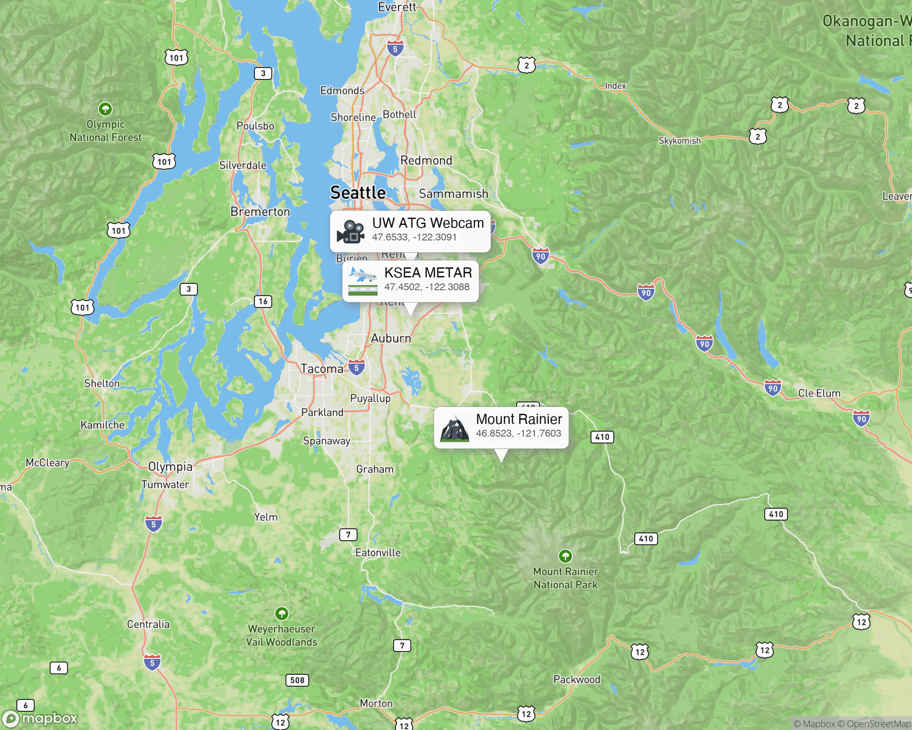

# is-the-mountain-out
Determine if Mount Rainier is "out" (visible) using real-time image classification with iterative LoRA training on live webcam streams, optimized for Apple Silicon (MPS).

## Overview
This system performs online learning using Parameter-Efficient Fine-Tuning (PEFT) with LoRA on a `convnext_tiny` vision backbone. It integrates METAR weather data as a secondary input to the classification head, improving the model's accuracy by incorporating real-world visibility and ceiling data.


*Map showing Mount Rainier, UW ATG Webcam, and KSEA METAR Station.*

## Features
- **Hardware-Accelerated Training:** Fully optimized for Mac M1/M2/M3 using Metal Performance Shaders (MPS).
- **Online Learning:** Iterative LoRA training using live webcam captures converted directly to PyTorch tensors with **zero disk usage** for training data.
- **Dual-Input Architecture:** Classification head accepts both image features (768) and a 2D METAR weather vector (visibility, ceiling).
- **Flexible Data Collection:** `collect` command for capturing datestamped datasets for offline batch training.
- **Periodic Training:** `launchctl` service management for continuous background training.
- **Batch Processing:** Support for training on local datasets with `/images` and `/metar` subfolders.
- **Interactive Classifier:** Modern React-based UI for bulk-labeling images with iOS-style drag-to-select and keyboard hotkeys.

## Usage
### Prerequisites
- [uv](https://github.com/astral-sh/uv) installed.
- Mac with Apple Silicon (for MPS acceleration).
- [Node.js](https://nodejs.org/) (for the React classification UI).

### Setup
1. Configure `mountain.toml` in the root directory for target mountain details, webcams, training parameters, and collection schedules.
2. Initialize the environment: `uv venv && uv pip install -e .`

### Network Access
When running on the local network or via Tailscale, the classifier is available at:
- **Tailscale:** https://tommys-mac-mini.tail59a169.ts.net/classify/
- **Local:** http://tommys-mac-mini.local:5173

### Commands
All commands should be run from the root directory:
```bash
# Start a continuous live training loop with gradient accumulation
uv run training live

# Single training cycle from live cameras (captures all webcams and trains once)
uv run training once

# Single capture of all webcams and METAR data to /data (git-ignored)
uv run collect collect

# Start a continuous collection loop in the foreground
uv run collect live

# Manage background collection service via launchctl
uv run collect schedule     # Install and load
uv run collect unschedule   # Unload and remove

# Batch train on a local folder (recursively finds data from 'collect' output)
uv run training batch data/20260222

# Manage background training service via launchctl (periodic execution of 'once')
uv run training schedule   # Install and load
uv run training unschedule # Unload and remove

# Manage the interactive classifier (React App)
uv run classify start [data_folder]
uv run classify stop
```

### Command Details
- **training live**: Runs a continuous loop. It uses **gradient accumulation** in-memory to perform a training step after a configurable number of captures.
- **training once**: Performs a single capture of configured webcams and METAR data, runs a single training step on that batch, and then exits.
- **training batch**: Recursively searches a folder for images and matches them with METAR data. Automatically handles class imbalance via oversampling.
- **collect collect**: Performs a single capture of all configured webcams and fetches METAR, saving them to a datestamped folder in `/data`.
- **collect schedule**: Installs and loads a `launchctl` service. Supports fixed intervals or multi-day solar-aligned plans.
- **classify start**: Launches a FastAPI backend and Vite frontend for rapid image labeling. Features iOS-style drag-to-select, 60-image batches, and hotkeys (`1`, `2`, `0`, `Space`).

## Training Goals & Metrics
The primary goal is to achieve a model capable of high-confidence mountain detection across varying weather and lighting conditions.

### Current State (Baseline - 2026-03-11)
After Phase 1 baseline training on 1,260 labeled images:
- **Baseline Accuracy:** Verified 100% on confirmed dark and mountain-visible regression test cases.
- **Dataset:** Highly imbalanced (1.4% "Out" rate); oversampling implemented to stabilize detection.

### Target Benchmarks
Before the model's predictions are considered "sufficient" to announce if the mountain is out, the following targets must be met:
- **Accuracy:** > 95% on a diverse validation set (including varying ceiling/visibility METAR values).
- **Precision:** > 98% (High priority on minimizing "false positives" where the mountain is announced as out but obscured).
- **Loss:** < 0.10.
- **F1-Score:** > 0.92.

## Technical Strategy
- **Backbone:** `convnext_tiny` via `timm`.
- **PEFT:** LoRA layers targeting the `fc1` and `fc2` Linear layers in the MLP blocks.
- **Weather Input:** Real-time METAR data from NOAA (e.g., KSEA) normalized and concatenated with image features.
- **Optimizer:** `Adam` with a single-batch or accumulated-batch training cycle.
- **Zero-Disk Training:** Live frames from `OpenCV` are moved directly to MPS tensors, avoiding overhead and privacy concerns related to storing temporary image files during the live loop.

## Project Structure
- `mountain.toml`: Target-specific configuration (coordinates, height, webcam links, training, collection).
- `train/`: Core training package (model, scheduler, utils).
- `collect/`: Standalone collection package.
- `ui/`: React-based classification frontend.
- `tools/`: Server-side classification backend and utility scripts.
- `data/`: Local storage for `collect` outputs (ignored by git).
