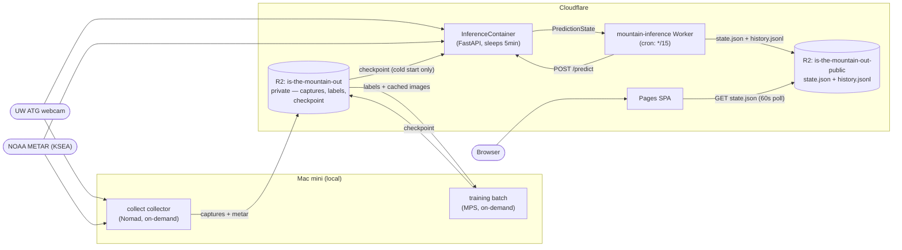
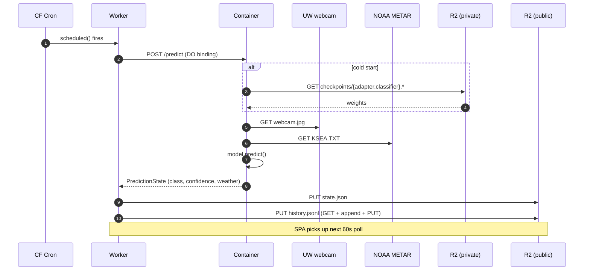
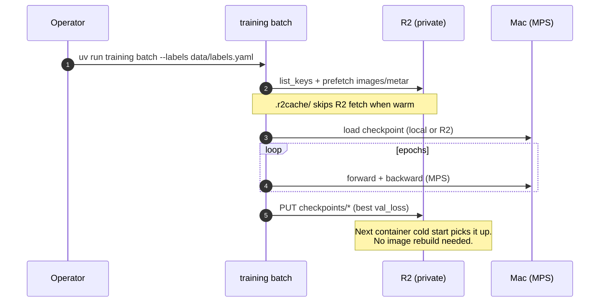

# is-the-mountain-out

Real-time image classifier that determines whether Mount Rainier is "out" (visible) from a live UW webcam, augmented with METAR weather data. ConvNeXt Tiny backbone + LoRA fine-tuning, trained on Apple Silicon (MPS), served from Cloudflare.

**Live site:** https://is-the-mountain-out.pages.dev — updated every 15 minutes.
Append `?debug` to see confidence bars and the raw METAR readout.


*Mount Rainier, the UW ATG webcam (north-northwest), and KSEA METAR station.*

## Architecture



### Inference tick (every 15 min)



### Training cycle (on demand)



## Current model state

Snapshot of the checkpoint currently live in R2 at `checkpoints/`:

| Field | Value |
|---|---|
| Backbone | `convnext_tiny` (timm, ImageNet pretrained) |
| Adapter | LoRA r=8 α=16 on `fc1`/`fc2` MLP layers |
| Head input | 768-dim image features ⊕ 2-dim weather (visibility, ceiling) |
| Classes | 0 = Not Out, 1 = Full, 2 = Partial |
| Capture window | 2026-02-22 → 2026-04-24 (55 days) |
| Captures in R2 | 2,057 jpgs + matching METAR |
| Labeled dataset | 2,000 (1,727 Not Out / 109 Full / 164 Partial) |
| Best val loss | 0.0782 |
| Val accuracy | 97.6% (15% stratified held-out, single-epoch run) |
| Checkpoint size | ~2.9 MB total (`adapter_model.safetensors` 2.1 MB + `classifier.pt` 795 KB + config 1 KB) |

Class-wise evaluation against the full labeled set (note: this is training data, not held-out — useful as a sanity check on class balance, not for generalization claims):

| Class   | Precision | Recall | F1   | Support |
|---------|----------:|-------:|-----:|--------:|
| Not Out |      1.00 |   0.99 | 0.99 |   1,727 |
| Full    |      0.88 |   1.00 | 0.94 |     109 |
| Partial |      0.93 |   0.94 | 0.94 |     164 |
| **macro avg** | **0.94** | **0.98** | **0.96** | 2,000 |

Targets the model is trying to meet before announcing "out" with confidence:

- Accuracy > 95% on a diverse held-out set
- Precision > 98% (priority on avoiding false positives — "the mountain is out" when it isn't)
- F1 > 0.92

## Repository layout

```
mountain.toml         configuration (mountain, webcam, METAR, training, R2 storage)
collect/              capture collector (Nomad job), R2 storage backend, classifier server
train/                model definition, scheduler, config loader, checkpoints
tools/                labeling backend, evaluation/pruning/ab-test scripts, predict_state
inference/            FastAPI server + Dockerfile for the Cloudflare Container
worker/               Cloudflare Worker source (TypeScript) + wrangler.toml
web/                  Public SPA (Vite + React), deployed by Cloudflare Pages
ui/                   Internal classifier UI for bulk labeling (Vite + React)
terraform/            Cloudflare Worker deploy (R2 buckets managed manually)
scripts/              deploy-inference.sh — one-command Worker redeploy
```

## Commands

Run from the repo root.

```bash
# Capture
uv run collect collect        # one capture (webcam + METAR) → local + R2 if [storage] enabled
uv run collect live           # continuous capture loop

# Training (reads from R2, writes checkpoint back to R2)
uv run training batch --labels data/labels.yaml --epochs N
uv run training live          # continuous live capture + gradient accumulation
uv run training once          # single capture + train cycle, then exit

# Internal labeling UI
uv run classify start [data_folder]
uv run classify stop

# Inference (server-side, used by the Cloudflare Container)
uv run python tools/predict_state.py --config mountain.toml

# Cloudflare Worker redeploy
scripts/deploy-inference.sh   # see script header for required env vars
```

## Configuration

Single source of truth: `mountain.toml`.

- `[mountain]`, `[webcam]`, `[weather]` — target mountain + data sources
- `[training]` — schedule, gradient accumulation, LoRA hyperparams
- `[collection]` — capture cadence
- `[storage]` — R2 backend (`backend = "r2"`, account/bucket/cache_dir)

R2 S3 credentials (`R2_ACCESS_KEY_ID`, `R2_SECRET_ACCESS_KEY`) live in `cf.env` (gitignored). The Worker holds the same values as secrets so the container can pull its checkpoint from R2 on startup.

## What runs where

| Component | Host | Trigger |
|---|---|---|
| Capture collector | Mac mini (Nomad) | Cron, on-demand |
| Training | Mac mini (MPS) | On-demand (`uv run training batch`) |
| Inference cron | Cloudflare Worker | `*/15 * * * *` |
| Inference compute | Cloudflare Container | Worker invocation |
| Storage | Cloudflare R2 | (always) |
| Public SPA | Cloudflare Pages | (always) |
| Container image | GHCR | Built by GH Actions on push to main |

GitHub's only remaining role is hosting the source repo and the container image registry. Nothing user-facing depends on GitHub Pages, GitHub Actions, or the operator's local machine being available — captures and training are operator-initiated, but the live site keeps serving and predicting on its own.

## Network access (Mac mini)

The internal labeling UI is exposed over the LAN and Tailscale:
- LAN: http://tommys-mac-mini.local:5188/classify/
- Tailscale: https://tommys-mac-mini.tail59a169.ts.net/classify/

## Setup

- [uv](https://github.com/astral-sh/uv) for Python deps; Mac with Apple Silicon for MPS.
- Node.js 20+ for the SPA and the internal classifier UI.
- `uv venv && uv pip install -e .` once at the top of the repo.
- `cp cf.env.example cf.env` and fill in R2 credentials (see `CLAUDE.md` for details).

See `CLAUDE.md` for in-repo conventions (data layout, Vite port registry, etc.).
